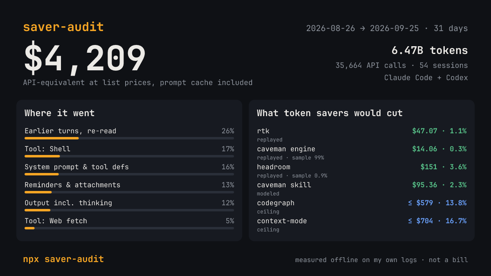

# saver-audit

**Where your Claude Code and Codex tokens really go, priced with prompt-cache costs, and what each token saver would actually cut on your own sessions.** One command, fully offline.

```
npx saver-audit
```



saver-audit reads the session logs that Claude Code (`~/.claude/projects`) and Codex (`~/.codex/sessions`) already keep on your machine. It then prints three things:

- **What you spent.** Your deduplicated usage, priced at list prices, including cache writes and cache reads.
- **What that context was.** Tool output by tool, earlier turns being re-read, the system prompt, your prompts.
- **What each popular token saver would have cut** from those same sessions. Every number is labelled with how it was obtained.

Nothing leaves your machine. The only network call is the one you ask for with `--update-prices`.

## Results on the author's own logs

30 days of the author's own work (2026-08-26 → 2026-09-25):
- 54 sessions and 813 subagent runs;
- 35,664 API calls;
- Claude Code and Codex.

**$4,209 API-equivalent** at list prices. That is what the same tokens cost through the API, not a bill; on a subscription you pay the plan price:

| Billed as | Cost | Share |
|---|---|---|
| Cache reads | $2,326 | 55% |
| Cache writes | $1,328 | 32% |
| Output (incl. thinking) | $520 | 12% |
| Uncached input | $36 | 1% |

**What that context was.** These are estimates; a token re-read by 50 calls counts 50 times.

| Content | Cost | Share |
|---|---|---|
| Earlier assistant turns, re-read (incl. thinking) | $1,090 | 26% |
| Tool output: shell | $711 | 17% |
| System prompt and tool definitions (not in the logs) | $687 | 16% |
| Reminders, attachments, command output | $546 | 13% |
| Assistant output | $520 | 12% |
| Tool output: web fetch | $202 | 5% |

**What each saver would have cut:**

| Saver | Method | Could touch | Saved | Of the bill |
|---|---|---|---|---|
| [rtk](https://github.com/rtk-ai/rtk) 0.50.0 | replayed (all 5,513 outputs) | 15% of tool output | $47 | 1.1% |
| [caveman](https://github.com/JuliusBrussee/caveman) proxy engine | replayed (60,339 of 60,341 outputs) | all tool output | $14 | 0.3% |
| [headroom](https://github.com/headroomlabs-ai/headroom) 0.38.0 | replayed, **1% sample** (300 of 30k) | 57% | $151 | 3.6% |
| caveman skill | modeled: −8.5% output (JetBrains), SKILL.md in every prompt | output | $95 | 2.3% |
| [codegraph](https://github.com/colbymchenry/codegraph) | upper bound | 43% | ≤ $579 | ≤ 13.8% |
| [context-mode](https://github.com/mksglu/context-mode) | upper bound | 61% | ≤ $704 | ≤ 16.7% |

The two biggest items are things no tool-output saver touches:
- **Re-reading earlier turns:** about a quarter of the cost is earlier assistant turns, thinking included, read again from cache on every call.
- **The fixed system prompt and tool definitions:** another 16%.

The headroom number comes from a 1% sample and is a lower estimate (see below). A full replay is pending.

## What the labels mean

- **replayed.** saver-audit sends the recorded tool output through *your installed copy* of the saver and counts what is left, measured against what the model actually saw.
  - For example, Claude Code cuts large Bash output down to a preview, so that preview is the baseline.
  - Replayed runs use a deterministic sample by default. `--full-replay` replays everything, and results are cached.
- **modeled.** An estimate from a published measurement, with the assumption printed next to it.
- **upper bound.** The saver changes how the agent behaves (which tools it calls), so replay can only give a ceiling: everything it could possibly remove.

Offline replay can't show whether a saver changes how the agent behaves: extra turns, retries, recalls, answer quality. The report says so every time.

## How the dollars are computed

- **Recorded usage is the truth.** Claude usage is deduplicated per API response (`message.id` + `requestId`, max per field). Codex `token_count` events are deduplicated, and history replayed into forked threads is skipped. Both match [ccusage](https://github.com/ccusage/ccusage) to the token on the author's logs.
- **Cache-aware savings.** A token removed from a tool output is priced as a cache write when it is first sent. It is then priced as a cache read on every later call until the next compaction, using each call's recorded cache pattern.
- **Token counts.** Per-block token counts use `o200k_base`, calibrated per Claude model against the usage in your own logs. Claude 4.7+ comes out at about 1.5× o200k on the author's logs, and the fit quality is printed. For OpenAI models, o200k is the tokenizer itself.
- **Prices.** Prices are a bundled, dated snapshot of [models.dev](https://models.dev) (1-hour cache writes at 2× input). `--update-prices` fetches a fresh one.

## Privacy

- **The report:** it never prints prompts, code, file contents, commands or tool output. Shell commands are reduced to fixed labels ("tests", "git"…), and project names are hidden unless you pass `--show-projects`.
- **The share card (`--card`):** it holds numbers, model names and dates only.
- **The replay cache** (`~/.cache/saver-audit/replay-v1.json`): it stores content hashes and token counts, never text.
- **Savers:** they run with their telemetry off and their state in a temporary folder.

## Options

```
saver-audit [--last 30d | --since 2026-09-01] [--until 2026-09-25] [--source claude-code|codex|all]
            [--json] [--card [path]] [--show-projects] [--update-prices]
            [--savers rtk,caveman-engine,headroom,caveman-skill,codegraph,context-mode]
            [--no-savers] [--full-replay] [--verbose]
```

## Savers you want replayed must be installed

saver-audit never bundles saver code. caveman's engine is BSL-1.1 and context-mode is Elastic-2.0. A replayed saver that isn't installed is listed as "not installed".

- **rtk:** `rtk` on your `PATH`.
- **caveman engine:** `caveman-engine` on your `PATH` or in `~/.caveman/bin`, or set `CAVEMAN_ENGINE_BIN`.
- **headroom:** a `headroom` install with the `[ml]` extra and its Kompress model downloaded, or set `SAVER_AUDIT_HEADROOM_PYTHON`. headroom leaves Read/Grep/Glob/Edit/Write/web output alone while it is recent and compresses it as it ages. saver-audit replays each output as the newest message, so its headroom number is a lower estimate.

`fast-jev-compaction` is not included. It acts only at compaction, and its decisions need its hosted API.

## Credit

The "savers save less than claimed" question isn't new. saver-audit builds on earlier work:
- an [r/LocalLLaMA replay of 500 sessions](https://www.reddit.com/r/LocalLLaMA/comments/1u9anzk/);
- [JetBrains'](https://blog.jetbrains.com/ai/2026/07/rtk-claude-code-token-savings/) and [Quesma's](https://quesma.com/blog/does-rtk-make-ai-coding-cheaper/) rtk benchmarks;
- [ccusage](https://github.com/ccusage/ccusage)'s parsing rules.

What saver-audit adds:
- one command on *your own* logs;
- Claude Code and Codex together;
- savings priced against the prompt cache;
- a method label on every number.

## Status

Pre-release (M3 of 4). Requires Node ≥ 20. MIT licence; bundled third-party components are listed in [THIRD_PARTY_NOTICES.md](THIRD_PARTY_NOTICES.md).
